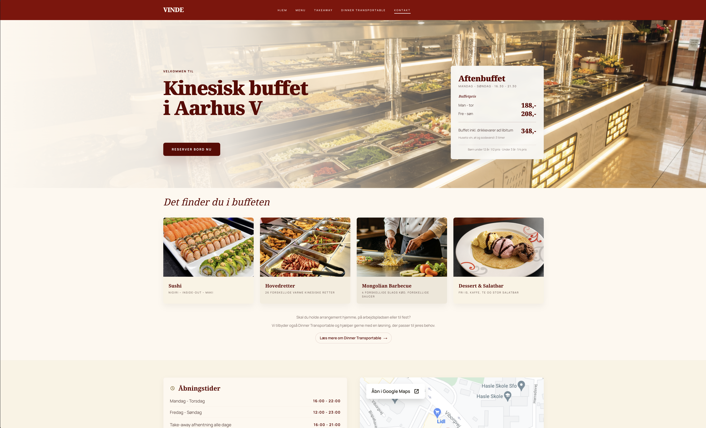

# Restaurant Vinde

Client website redesign for `restaurantvinde.dk`.

This project is a modern redesign of an older restaurant website I originally designed for the client. I rebuilt it into a cleaner, more maintainable frontend using React, Next.js, and Tailwind CSS, with a stronger focus on responsive design, visual hierarchy, and long-term scalability.

## Project Summary

- Redesigned the public-facing website for Restaurant Vinde in Aarhus
- Replaced the older structure with a modern React-based frontend
- Improved the mobile experience, layout consistency, and content presentation
- Structured the codebase for easier maintenance and future expansion
- Initially explored a customer-editable content setup for prices and text, but decided against it because site updates are infrequent and the added complexity was not justified

## Tech

- React
- Next.js
- Tailwind CSS
- TypeScript

## Deployment

The site is deployed directly from this repository using GitHub Actions.

When changes are pushed to `main`, the deployment workflow:

- builds the site as a static export
- generates the production output in `web/out/`
- uploads the files to the live server via SSH and `rsync`

This means pushes to `main` publish directly to the live site.

## Purpose

This repository is intended as a project showcase and working codebase for the redesign, documenting both the frontend implementation and the deployment setup behind the live customer site.
